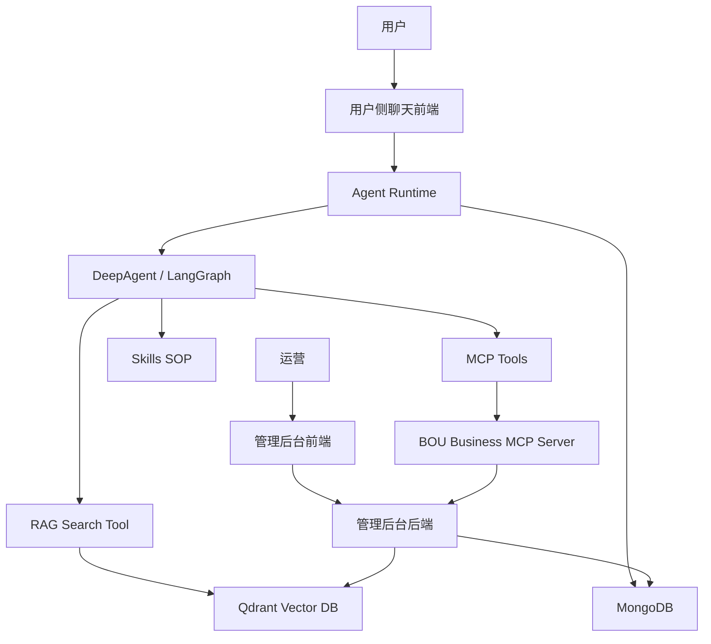
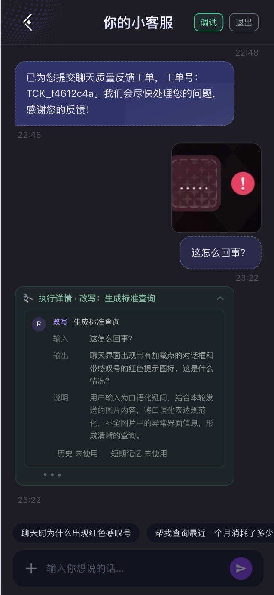
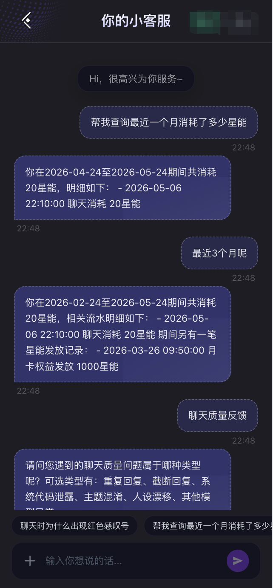
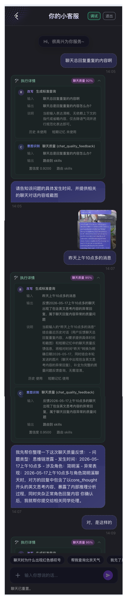
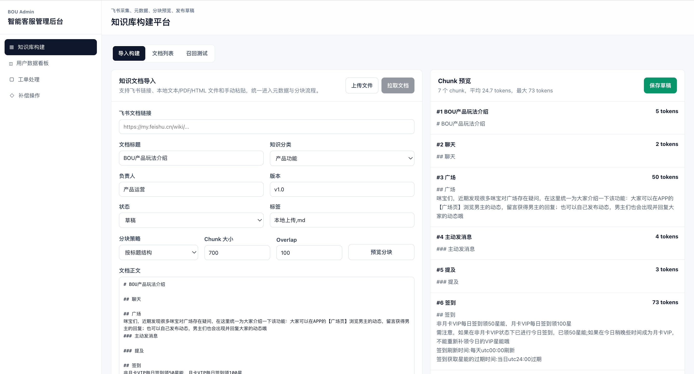
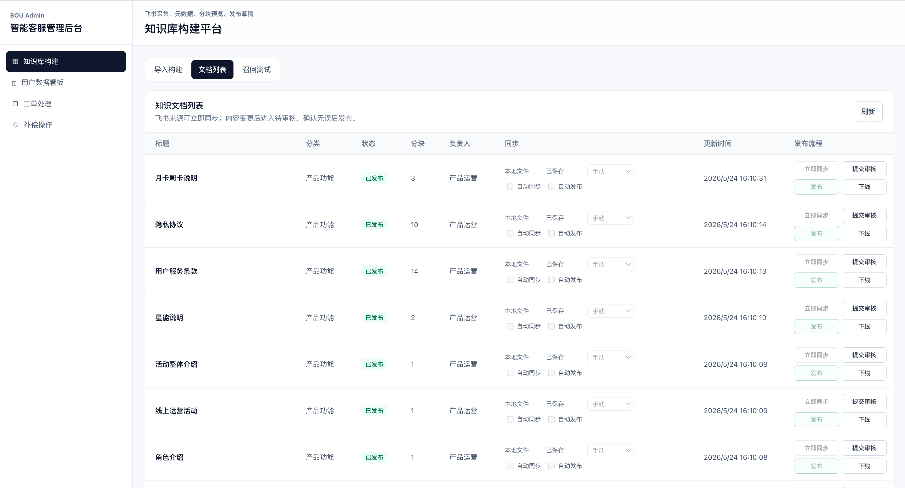
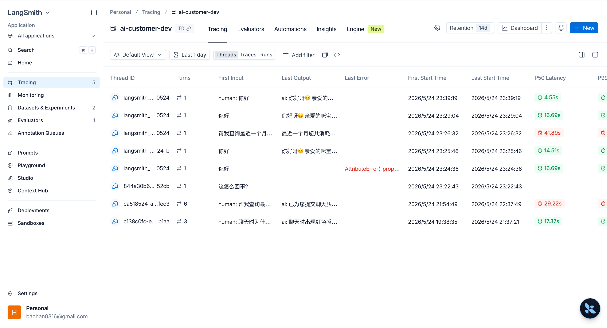

# BOU AI Customer Service

一个面向真实客服场景设计的全栈 AI 客服 Agent 项目。

它不是单纯的聊天 Demo，而是把用户侧客服、运营管理后台、知识库构建、RAG 检索、MCP 业务工具调用、Skills SOP 链路和 LangSmith 可观测评测串成了一套完整闭环。

## 项目亮点

- **Agent Runtime**：基于 DeepAgent / LangGraph 构建用户侧客服 Agent，支持 query rewrite、意图识别、RAG、MCP 工具调用和 SSE 流式回复。
- **RAG 知识库链路**：运营后台维护知识文档，完成元数据管理、分块预览、向量化发布，客服 Agent 只检索已发布知识。
- **MCP 业务工具链路**：独立的 `bou-business` 模拟真实业务系统，将账号、订单、资产、聊天质量反馈等能力暴露为 MCP tools。
- **Skills SOP 能力**：通过 filesystem skills 管理复杂客服场景 SOP，例如聊天质量反馈、异常回复受理、证据收集和工单提交。
- **管理后台**：支持知识库构建、工单查看、AI 链路摘要、RAG / MCP 痕迹追踪、补偿操作等运营工作流。
- **LangSmith 监控与评测**：支持 trace、dataset evaluation、工具调用记录、RAG top-k、意图分类和延迟等指标分析。

## 系统架构



## 核心链路截图

### 1. RAG / MCP / Skills 联动 Case

这里展示一次完整客服处理链路：用户问题进入 Agent 后，先完成意图识别和问题改写，再根据场景选择 RAG 知识库、MCP 业务工具或 Skills SOP，最后生成可解释的客服回复。

图文混合输入，改写后，RAG知识问题


MCP实现实时数据查询


复杂意图，skills处理


### 2. 管理后台：知识库构建

运营可以在后台维护知识文档，配置分类、负责人、版本、标签、适用范围和分块策略；发布后的内容会写入共享向量库，供用户侧 Agent 检索。




### 3. LangSmith 监控与评测

通过 LangSmith 观察 Agent 的每轮调用过程，包括模型输入输出、工具调用、RAG 召回结果、意图分类、响应延迟和评测结果，方便持续优化 BadCase。



## 技术栈

- Frontend：Vue / Vite / Tailwind CSS
- Backend：FastAPI / LangChain / LangGraph / DeepAgents
- Agent Tools：RAG Search / MCP Tools / filesystem Skills
- Vector DB：Qdrant
- Database：MongoDB
- Business Mock：Node.js / MCP Server
- Observability：LangSmith
- Deployment：Docker Compose

## 项目结构

```text
frontend/          用户侧聊天前端
backend/           用户侧 Agent Runtime
admin/frontend/    运营管理后台前端
admin/backend/     管理后台 API
bou-business/      独立业务系统模拟层，提供 REST API 和 MCP Server
mongodb            对话、工单、后台数据持久化
qdrant             知识库向量检索
```

## 本地启动

```bash
make dev-up
make dev-check
```

访问地址：

```text
用户侧聊天：http://127.0.0.1:5173/chat
管理后台：http://127.0.0.1:5174/admin
用户侧后端：http://127.0.0.1:8000/health
管理后台后端：http://127.0.0.1:8001/health
业务 MCP：http://127.0.0.1:8011/health
```

## 我想解决的问题

传统客服系统往往把“知识库”“业务查询”“人工工单”“质量反馈”“效果评测”拆成多个孤立模块。这个项目尝试把它们统一进一个可追踪、可运营、可评测的 AI Agent 工作流里：

- 产品规则问题走 RAG，保证回答有知识来源；
- 用户资产、订单、账号问题走 MCP，保证能访问实时业务数据；
- 复杂异常场景走 Skills，把客服 SOP 固化成可复用链路；
- BadCase 进入后台和 LangSmith，形成持续迭代闭环。